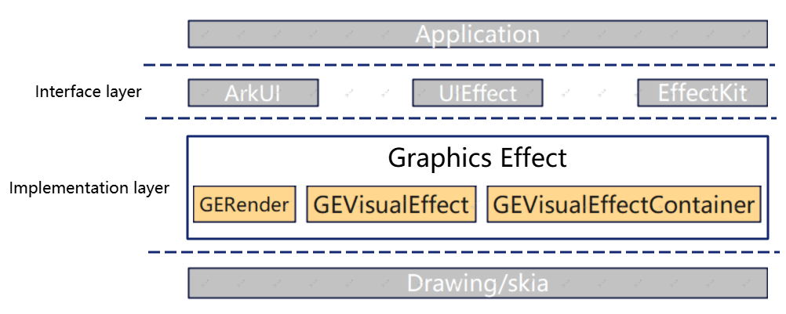

# graphics_effect

## Description
graphics_effect is an important component of OpenHarmony's graphics subsystem, providing the necessary visual effects algorithm capabilities for the graphics subsystem, including blur, shadow, gradient, grayscale, brighten, invert, enhance, etc.

## Software Architecture


The layered description of Graphics Effect is as follows:

• Interface layer: Graphics Effect opens its capabilities to the outside world through ArkUI, UIEffect, and EffectKit.

• Implementation layer: divided into three modules: GERender, GEVisualEffect, and GEVisualEffectContainer.
| Modules                                          | Capability description                                                                        |
|--------------------------------------------------|-----------------------------------------------------------------------------------------------|
| GERender(rendering)                              | provides drawing capabilities and draws the effects of GEVisualEffect onto the target canvas. |
| GEVisualEffect(visual effect)                    | implementation of specific visual effect capabilities.                                        |
| GEVisualEffectContainer(visual effect container) | convenient integration of multiple visual effects.                                            |

## Directory structure
```
foundation/graphic/graphics_effect/
├── figures                 # Image directory referenced by Markdown
├── include                 # Graphics Effect interface storage directory
│   ├── ext                 # Dynamic loading framework interface and algorithm interface storage directory
├── src                     # Source code storage directory
│   ├── ext                 # Dynamic loading framework and algorithm interface implementation storage directory
└── test                    # Test case storage directory
    ├── fuzztest            # Fuzz test case storage directory
    └── unittest            # Unit test case storage directory
```

## Installation

Not involved

## Instructions

The capabilities of this component have been integrated into system UI rendering scenarios such as the desktop, status bar, and control center, and users can directly operate and use it and experience the corresponding effects.

### 1.Draw the specified visual effect onto the canvas

Based on the specified image, apply the visual effect contained in the GEVisualEffectContainer and draw it directly onto the passed canvas.
```
void DrawImageEffect(Drawing::Canvas& canvas, Drawing::GEVisualEffectContainer& veContainer,
        const std::shared_ptr<Drawing::Image>& image, const Drawing::Rect& src, const Drawing::Rect& dst,
        const Drawing::SamplingOptions& sampling);
```
Example：
```
  Drawing::Canvas canvas;
  auto image = std::make_shared<Drawing::Image>();
  auto visualEffectContainer = std::make_shared<Drawing::GEVisualEffectContainer>();
  DrawImageRectAttributes attr;

  auto geRender = std::make_shared<GraphicsEffectEngine::GERender>();
  geRender->DrawImageEffect(canvas, *visualEffectContainer, image, attr.src, attr.src, Drawing::SamplingOptions());
```

### 2.Draw the specified visual effect onto the canvas and return the drawing result as an image

Based on the specified image, apply the visual effect contained in the GEVisualEffectContainer and return the drawing result as image
```
std::shared_ptr<Drawing::Image> ApplyImageEffect(Drawing::Canvas& canvas,
        Drawing::GEVisualEffectContainer& veContainer, const std::shared_ptr<Drawing::Image>& image,
        const Drawing::Rect& src, const Drawing::Rect& dst, const Drawing::SamplingOptions& sampling);
```
Example：
```
  Drawing::Canvas canvas;
  auto image = std::make_shared<Drawing::Image>();
  auto visualEffectContainer = std::make_shared<Drawing::GEVisualEffectContainer>();
  DrawImageRectAttributes attr;

  auto geRender = std::make_shared<GraphicsEffectEngine::GERender>();
  auto outImage = geRender->ApplyImageEffect(canvas, *visualEffectContainer, image, attr.src, attr.src, Drawing::SamplingOptions());
```
